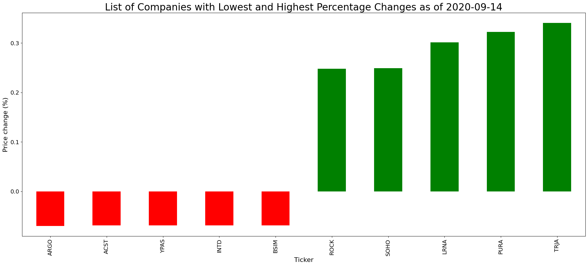
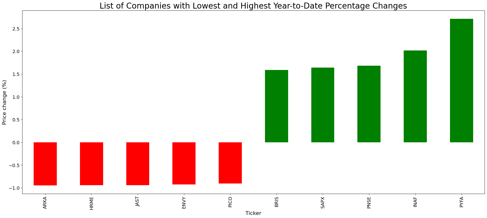
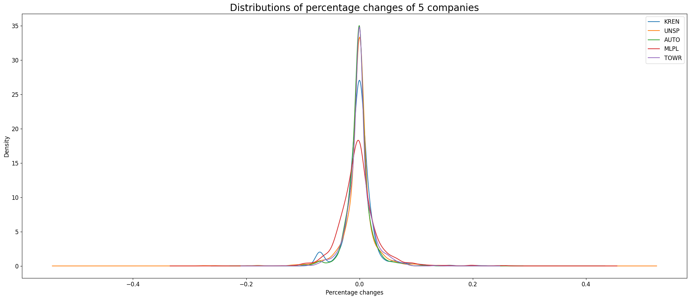
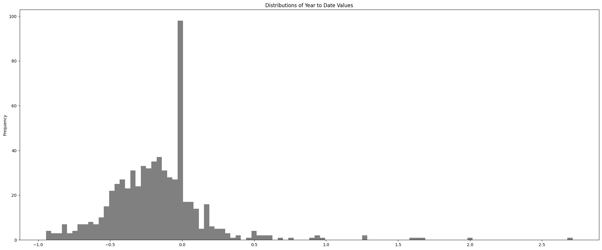
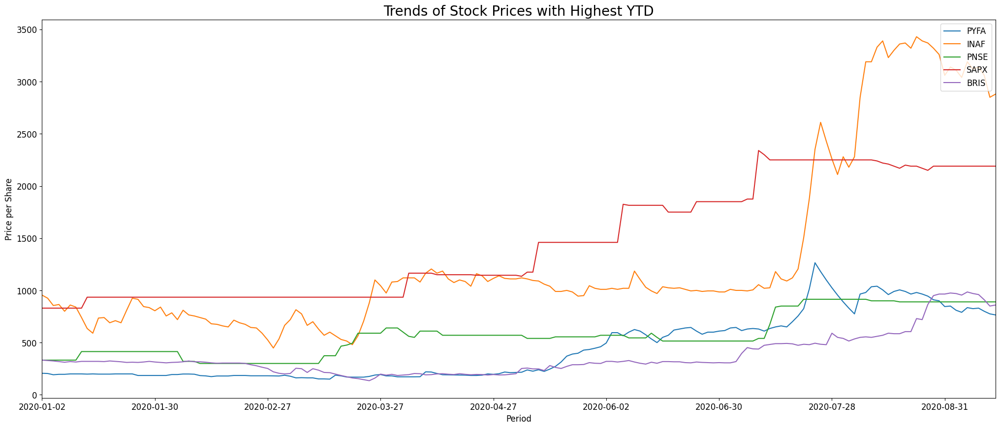
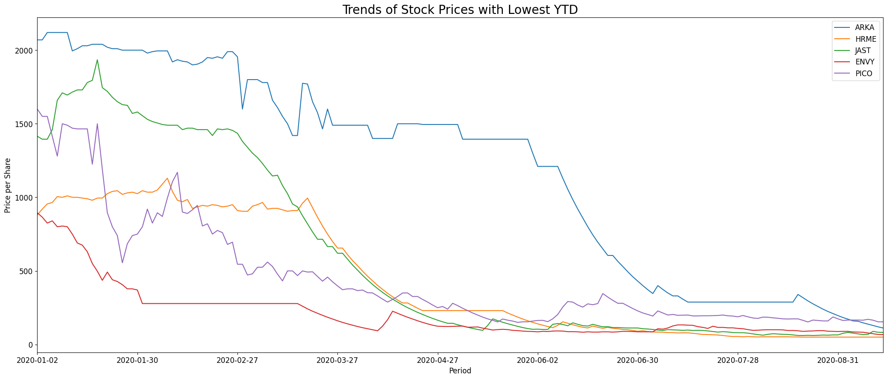
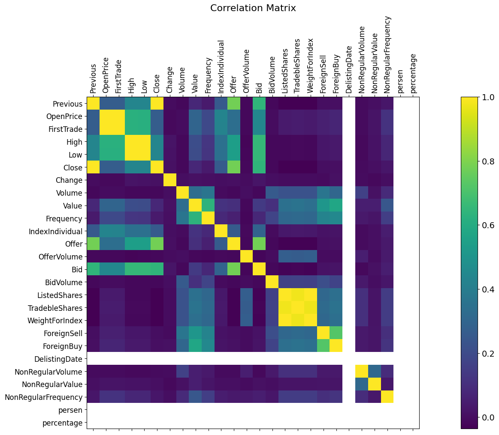

# About

This repository aims to get the financial data of publicly listed companies in Indonesia 🇮🇩 for free. It includes reference data (e.g. company profiles, organization structures, etc), daily trading summary (e.g. high, low, bid, ask, foreign buy/sell, etc), and financial statements (balance sheet, profit/loss, and cash flow). This repository is automatically updated daily so you can just chill and relax 😎 🏖 🥥 🌴 🍻.

TL;DR: if you don't want to run this locally and just want to go straight to the data, which are located under `data` directory. You can proceed as follows:

|file_name|description|
NEED TO BE UPDATED.

# Plot Examples
Below are plot examples, which are automatically updated daily at 12 AM UTC+7 (Jakarta time).

#### 1. Bar
- ##### Today


- ##### Year to Date


#### 2. Density


#### 3. Histogram


#### 4. Trend lines
- ##### Highest YTD


- ##### Lowest YTD


#### 5. Correlation matrix


# Permission
How can we be sure that it's totally okay to get the data from the website? Open [<strong>`its robots.txt site`</strong>](https://idx.co.id/robots.txt) and see the following result:

```
Server Error

404 - File or directory not found.
The resource you are looking for might have been removed, had its name changed, or is temporarily unavailable.
```

It doesn't seem that they care whether or not we scrape their data. 😃

# Clone
Cloning this repository to your local machine is as easy as A-B-C. Just do the following on terminal:

```bash
git clone https://github.com/ledwindra/indonesia-stock-exchange.git
cd indonesia-stock-exchange/
```

# Virtual environment and dependencies
Run the following on terminal if you don't want to mess around with existing modules installed on your machine:

```bash
python -m venv [VIRTUAL-ENVIRONMENT-NAME] # can be anything. for example .venv
source [VIRTUAL-ENVIRONMENT-NAME]/bin/activate
python -m pip install -r requirements.txt
```

To exit from the virtual environment, run `deactivate`.

# End
Hope you enjoy this. Thanks for reading! :smile:
